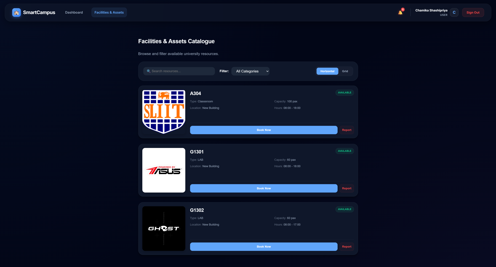
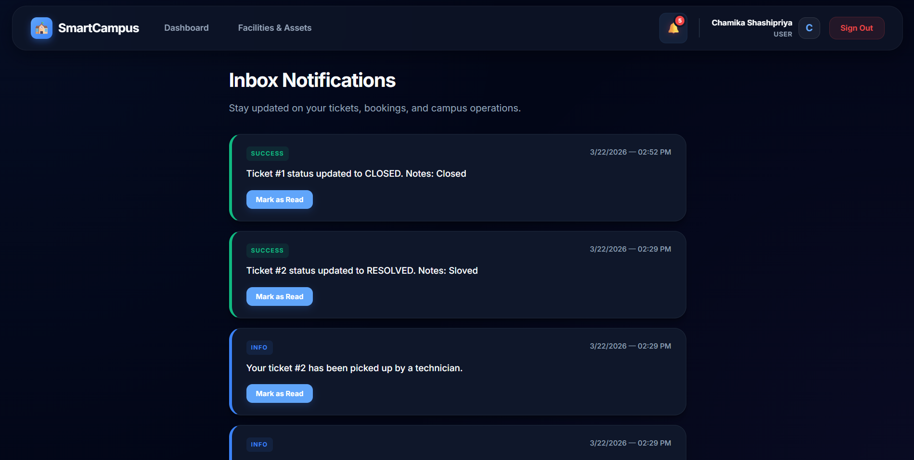
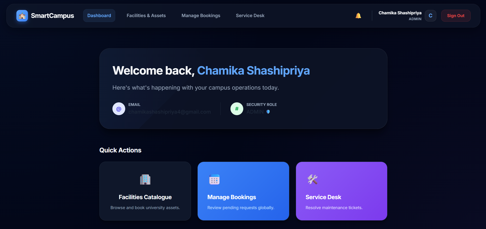
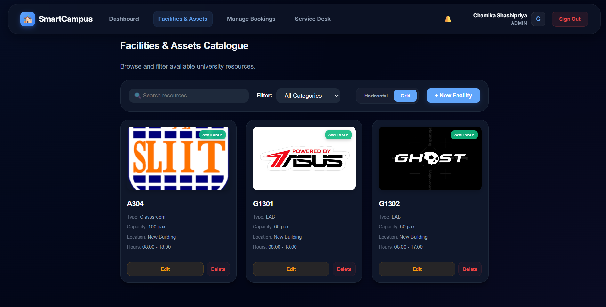
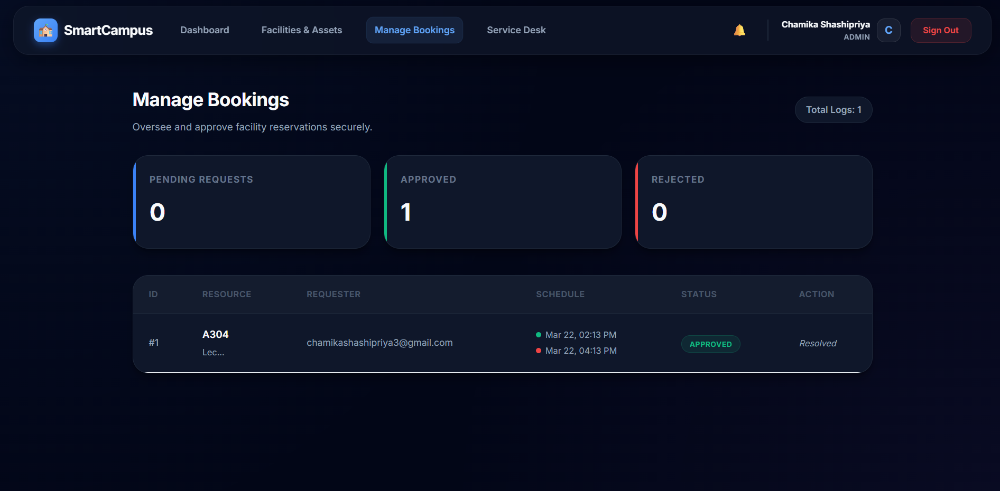
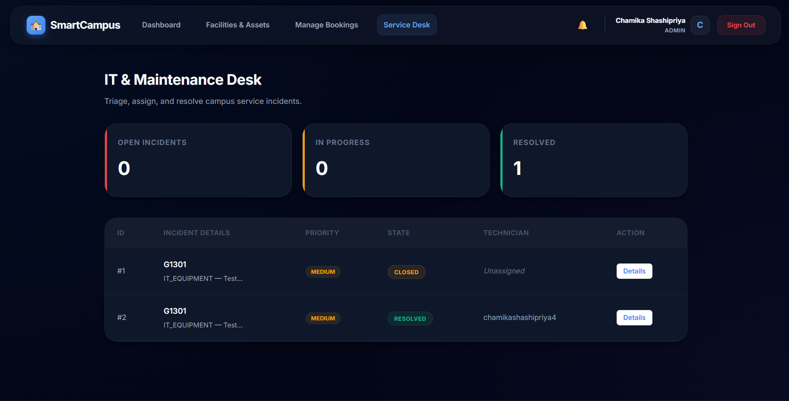

# Smart Campus Operations Hub 🏫✨

A modern university facility management and resource booking system with real-time incident tracking, collaborative ticket management, and intuitive administrative dashboards.

Built with **React 18**, **Spring Boot 3.4.5**, and **MySQL 8.0** with JWT authentication and Google OAuth2 integration.

---

## Features ✨

- **🔐 Secure Authentication** — JWT-based stateless auth + Google OAuth2 login
- **📚 Resource Catalogue** — Browse, filter, and manage university facilities and equipment
- **📅 Smart Booking System** — Intelligent conflict detection prevents double-booking
- **🎫 Issue Tracking** — Report problems with attachments, track resolution progress
- **💬 Collaborative Comments** — Team discussion on tickets with threaded comments
- **🔔 Real-time Notifications** — Get notified of booking approvals, ticket updates
- **👨‍💼 Admin Dashboard** — Comprehensive system overview with analytics and management tools
- **🎨 Premium UI/UX** — Dark theme with glassmorphism, responsive design
- **🔑 Role-Based Access** — Three-tier permissions (User, Admin, Technician)

---

## Why SmartCampus? 🎯

Managing university resources manually is error-prone and inefficient. SmartCampus solves this by:

- **Preventing conflicts** — Real-time booking validation prevents overlapping reservations
- **Streamlining operations** — Centralized facility and incident management
- **Improving transparency** — Students see booking status; admins have full visibility
- **Enabling collaboration** — Technicians and staff can work together on issue resolution

---

## 💻 Tech Stack

| Component | Technology |
|-----------|-----------|
| **Frontend** | React 18, Vite, Vanilla CSS |
| **Backend** | Spring Boot 3.4.5, Spring Security |
| **Database** | MySQL 8.0 |
| **Authentication** | JWT + Google OAuth2 |
| **Testing** | JUnit 5, Mockito |
| **Build** | Maven (Backend), Vite (Frontend) |

---

## 🚀 Quick Start

### Prerequisites
- Java 17+
- Node.js 18+
- MySQL 8.0+
- Google OAuth2 credentials

### 1. Database Setup
```bash
mysql -u root -p
CREATE DATABASE smart_campus;
EXIT;
```

### 2. Backend Setup
```bash
cd backend

# Configure credentials
cp src/main/resources/application.properties.example src/main/resources/application.properties
# Edit application.properties with your MySQL & Google OAuth2 credentials

# Run tests
./mvnw test

# Start server
./mvnw spring-boot:run
```
Backend runs at **http://localhost:8080**

### 3. Frontend Setup
```bash
cd frontend

npm install
npm run dev
```
Frontend runs at **http://localhost:5173**

---

## 📚 API Documentation

### Authentication Endpoints
```
POST   /api/auth/register              Register new user
POST   /api/auth/login                 Login with credentials
GET    /api/auth/me                    Get current user profile
```

### Resource Management
```
GET    /api/resources                  List all resources (filterable)
GET    /api/resources/{id}             Get resource details
POST   /api/resources                  Create resource (Admin)
PUT    /api/resources/{id}             Update resource (Admin)
DELETE /api/resources/{id}             Delete resource (Admin)
```

### Bookings
```
POST   /api/bookings                   Create booking request
GET    /api/bookings                   List user's bookings
PATCH  /api/bookings/{id}/approve      Approve booking (Admin)
PATCH  /api/bookings/{id}/reject       Reject booking (Admin)
```

### Tickets
```
POST   /api/tickets                    Create incident ticket
GET    /api/tickets/{id}               Get ticket details
POST   /api/tickets/{id}/comments      Add comment
PUT    /api/tickets/{id}/status        Update status (Technician/Admin)
```

### Notifications
```
GET    /api/notifications/user/{id}    Get user notifications
PUT    /api/notifications/{id}/read    Mark notification as read
```

---

## 🌟 Key Highlights

- **Premium Aesthetics**: Custom dark theme with glassmorphism and smooth animations
- **Conflict Detection**: Prevents overlapping bookings at database query level  
- **Multi-role Support**: Specialized views for Students, Technicians, and Admins
- **Real-time Updates**: Notifications trigger automatically on booking/ticket state changes
- **Fully Tested**: 20+ unit tests with Mockito covering core business logic

---

## 🎯 Core Modules

### Authentication & Authorization
Secure JWT-based authentication with Google OAuth2 integration. Users can sign up, log in, and maintain sessions without managing password complexity.

**Features:**
- Email/password registration and login
- Google OAuth2 single sign-on
- JWT token persistence
- Role-based access control (USER, ADMIN, TECHNICIAN)

### Resource Catalogue
Browse and search campus facilities and equipment with advanced filtering.

**Features:**
- List/Grid view toggle for resources
- Filter by type, capacity, location, availability
- Real-time search functionality
- Admin resource management (CRUD)

### Booking System
Request resource bookings with automatic conflict detection.

**Features:**
- Intuitive booking creation with date/time selection
- Real-time conflict detection prevents double-booking
- Approval workflow (Admin reviews pending bookings)
- Booking status tracking (PENDING, APPROVED, REJECTED, CANCELLED)

### Incident Ticketing
Report issues and track resolution with team collaboration.

**Features:**
- Create tickets with category, priority, description
- File attachments (up to 3 per ticket)
- Technician assignment and status tracking
- Collaborative comments on tickets
- Resolution notes and audit trail

### Admin Dashboard
System-wide overview with management tools.

**Features:**
- Dashboard analytics (KPIs, metrics, trends)
- Pending booking approvals queue
- Ticket management and analytics
- User management with role updates
- System health monitoring

### Notifications
Stay updated on booking approvals, ticket assignments, and status changes.

**Features:**
- Real-time notification delivery
- Type-based categorization (INFO, SUCCESS, WARNING)
- Mark as read / mark all as read
- Unread badge count in header
PATCH  /api/tickets/{id}/status         — Update status (Admin/Technician)
PATCH  /api/tickets/{id}/assign         — Assign technician (Admin)
---

## 📁 Project Structure

```
smart-campus/
├── backend/
│   ├── src/main/java/com/smartcampus/backend/
│   │   ├── controller/          # REST API endpoints
│   │   ├── model/               # JPA entities
│   │   ├── service/             # Business logic
│   │   ├── repository/          # Database queries
│   │   └── security/            # Auth & JWT configuration
│   ├── src/test/                # Unit tests (JUnit 5, Mockito)
│   └── pom.xml                  # Maven dependencies
│
├── frontend/
│   ├── src/
│   │   ├── pages/               # React page components
│   │   ├── components/          # Reusable UI components
│   │   ├── context/             # Global state (Auth, Notifications)
│   │   ├── api/                 # Axios configuration
│   │   ├── App.jsx              # Main component
│   │   └── main.jsx             # Entry point
│   ├── package.json             # Node dependencies
│   └── vite.config.js           # Vite bundler config
│
└── docs/                        # Screenshots and documentation
```

---

## 🧪 Testing

Run tests with:
```bash
cd backend
./mvnw test
```

Coverage includes:
- ResourceService (filtering, CRUD operations)
- BookingService (conflict detection, workflow)
- TicketService (lifecycle management, notifications)
- AuthController (registration, login, authorization)

---

## 🔐 Security Features

- **JWT Tokens** — Stateless authentication with expiration
- **Password Hashing** — BCrypt encoding for stored passwords
- **CORS Protection** — Restricted to frontend origin
- **Role-Based Access** — Endpoint-level authorization with @PreAuthorize
- **SQL Injection Prevention** — Parameterized queries via JPA

---

## 🤝 Contributing

Contributions are welcome! Please feel free to submit issues and pull requests.

### Development Workflow
1. Create a feature branch: `git checkout -b feature/your-feature`
2. Make your changes and commit: `git commit -m 'feat: add your feature'`
3. Push to the branch: `git push origin feature/your-feature`
4. Submit a pull request

---

## 📄 License

This project is part of the IT3030 PAF Assignment (2026, Semester 1). 

---

---

## 👨‍💼 Authors

- **Sajalee** (IT234576869) — Backend Auth, Notifications, Admin Dashboard
- **Member 1** — Resources & Booking System
- **Member 2** — Tickets & Comments

---

**Built with ❤️ for efficient campus operations**
│
├── controller/
│   ├── AuthController.java                    ← Sajalee (Auth endpoints)
│   ├── NotificationController.java            ← Sajalee (Notifications)
│   ├── ResourceController.java                ← Member 1 (Resource CRUD)
│   ├── BookingController.java                 ← Member 1 (Booking workflow)
│   └── TicketController.java                  ← Member 2 (Ticket management)
│
├── model/
│   ├── User.java                              ← Sajalee (Auth)
│   ├── Role.java                              ← Sajalee (Auth)
│   ├── Notification.java                      ← Sajalee (Notifications)
│   ├── Resource.java                          ← Member 1 (Resources)
│   ├── Booking.java                           ← Member 1 (Bookings)
│   ├── BookingStatus.java                     ← Member 1 (Bookings)
│   ├── Ticket.java                            ← Member 2 (Tickets)
│   ├── TicketStatus.java                      ← Member 2 (Tickets)
│   ├── TicketComment.java                     ← Member 2 (Comments)
│   └── TicketAttachment.java                  ← Member 2 (Attachments)
│
├── service/
│   ├── UserService.java                       ← Sajalee (Auth)
│   ├── NotificationService.java               ← Sajalee (Notifications)
│   ├── ResourceService.java                   ← Member 1 (Resources)
│   ├── BookingService.java                    ← Member 1 (Bookings)
│   ├── TicketService.java                     ← Member 2 (Tickets)
│   └── AdminService.java                      ← Sajalee (Admin)
│
├── repository/
│   ├── UserRepository.java                    ← Sajalee (Auth)
│   ├── NotificationRepository.java            ← Sajalee (Notifications)
│   ├── ResourceRepository.java                ← Member 1 (Resources)
│   ├── BookingRepository.java                 ← Member 1 (Bookings)
│   └── TicketRepository.java                  ← Member 2 (Tickets)
│
└── security/
    ├── SecurityConfig.java                    ← Sajalee (Auth)
    ├── JwtUtils.java                          ← Sajalee (JWT)
    ├── JwtAuthenticationFilter.java           ← Sajalee (JWT Filter)
    └── OAuth2LoginSuccessHandler.java         ← Sajalee (OAuth2)
```

### Frontend Structure
```
frontend/src/
│
├── pages/
│   ├── Login.jsx                              ← Sajalee (Auth UI)
│   ├── Dashboard.jsx                          ← User home (integrates all)
│   ├── Notifications.jsx                      ← Sajalee (Notifications)
│   ├── Settings.jsx                           ← Sajalee (User settings)
│   ├── AdminPanel.jsx                         ← Sajalee (Admin dashboard)
│   ├── Catalogue.jsx                          ← Member 1 (Resource browse)
│   ├── BookResource.jsx                       ← Member 1 (Booking form)
│   ├── ManageBookings.jsx                     ← Member 1 (Booking management)
│   ├── ReportIssue.jsx                        ← Member 2 (Ticket creation)
│   ├── TicketDetails.jsx                      ← Member 2 (Ticket view)
│   └── TechnicianDashboard.jsx                ← Member 2 (Technician view)
│
├── context/
│   ├── AuthContext.jsx                        ← Sajalee (Global auth state)
│   └── NotificationContext.jsx                ← Sajalee (Global notifications)
│
├── components/
│   ├── Navbar.jsx                             ← Navigation (all)
│   └── Toast.jsx                              ← Notifications UI (all)
│
└── api/
    └── axiosConfig.js                         ← Sajalee (JWT interceptor)
```

---

## 📊 Member Contribution Matrix

| Responsibility | Member 1 | Member 2 | Sajalee |
|---|---|---|---|
| **Backend Models** | Resource, Booking | Ticket, TicketComment, TicketAttachment | User, Notification |
| **Backend Services** | ResourceService, BookingService | TicketService | UserService, NotificationService, AdminService |
| **Backend Controllers** | ResourceController, BookingController | TicketController | AuthController, NotificationController, AdminController |
| **Frontend Pages** | Catalogue, BookResource, ManageBookings | ReportIssue, TicketDetails, TechnicianDashboard | Login, Notifications, Settings, AdminPanel |
| **Endpoints** | 7 (/api/resources, /api/bookings) | 6 (/api/tickets, /api/tickets/{id}/comments) | 11 (/api/auth/*, /api/notifications/*, /api/admin/*) |
| **Key Features** | Resource catalogue, Booking conflict detection | Ticket lifecycle, File attachments, Comments | JWT Auth, OAuth2, Notifications, Admin dashboard |

---

## � Git Commit Strategy

Each team member should use **Conventional Commits** format with descriptive messages. Here's the breakdown:

### Member 1 - Resources & Bookings
**Commit 1:**
```
feat(resources): implement resource catalogue with filtering and availability management

DESCRIPTION:
- Resource model with type classification (LECTURE_HALL, LAB, MEETING_ROOM, EQUIPMENT)
- ResourceService with search & filtering by type, capacity, location
- ResourceController with full CRUD operations (GET, POST, PUT, DELETE, PATCH)
- Availability validation for booking conflicts
- Frontend: Catalogue.jsx with List/Grid view toggle
```

**Commit 2:**
```
feat(bookings): implement booking system with conflict detection and approval workflow

DESCRIPTION:
- Booking model with status workflow (PENDING, APPROVED, REJECTED, CANCELLED)
- Conflict detection: prevents overlapping bookings on same resource
- BookingService validates time ranges against resource availability
- BookingController manages user and admin booking operations
- Frontend: BookResource.jsx for creation, ManageBookings.jsx for management
- Triggers notifications via NotificationService on status changes
```

### Member 2 - Tickets & Collaboration
**Commit 1:**
```
feat(tickets): implement ticket management system with attachments and status tracking

DESCRIPTION:
- Ticket model with complete lifecycle (OPEN, IN_PROGRESS, RESOLVED, CLOSED, REJECTED)
- TicketAttachment model for file uploads (max 3 per ticket)
- Status transition validation and technician assignment
- TicketService with file handling and notification triggers
- TicketController with ticket CRUD and admin operations
- Frontend: ReportIssue.jsx for creation, TicketDetails.jsx for viewing
- TechnicianDashboard.jsx for technician workflow
```

**Commit 2:**
```
feat(tickets): add collaborative commenting and discussion features

DESCRIPTION:
- TicketComment model for threaded discussions
- CommentService with ownership validation (edit/delete own only)
- TicketCommentController for comment CRUD operations
- Automatic notifications when new comments posted
- Frontend: Enhanced TicketDetails.jsx with comment section
- Comment edit/delete functionality with timestamps
```

### Sajalee - Auth, Notifications & Admin
**Commit 1:**
```
feat(core): implement JWT authentication and notification system for SmartCampus

DESCRIPTION:
- User model with email/password and role-based access (ROLE_USER, ROLE_ADMIN, ROLE_TECHNICIAN)
- JWT-based stateless authentication with token storage in localStorage
- OAuth2 Google login integration with success handler
- SecurityConfig with Spring Security + JWT filter + CORS
- Notification model with type-based delivery (INFO, SUCCESS, WARNING)
- NotificationService with broadcast and individual notification delivery
- AuthController with register, login, and profile endpoints
- NotificationController with inbox and read status management
- Frontend: Login.jsx with dual Sign In/Register + Google OAuth button
- Frontend: Notifications.jsx with notification inbox and badge count
- AuthContext.jsx for global user state management
```

**Commit 2:**
```
feat(admin): implement admin dashboard with user management and settings

DESCRIPTION:
- AdminController with dashboard statistics and aggregated metrics
- UserManagementService for role updates and user administration
- DashboardService for cross-module analytics (bookings, tickets, resources, users)
- ReportService for system-wide reporting
- AuditService for tracking admin actions
- Frontend: AdminPanel.jsx with dashboard, approval queue, user management sections
- Frontend: Settings.jsx with profile, password, preferences, security settings
- Admin functionality: Approve/reject bookings, manage tickets, update user roles
- System health monitoring and utilization analytics
```

---

## �🚀 Getting Started

### Prerequisites
- Java 17+
- Node.js 18+
- MySQL 8.0+
- A Google Cloud OAuth2 Client ID & Secret

### 1. Database Setup
```sql
CREATE DATABASE smart_campus;
```

### 2. Backend Setup
1. Navigate to `/backend`
2. Copy credentials into `src/main/resources/application.properties`:
   ```properties
   spring.datasource.url=jdbc:mysql://localhost:3306/smart_campus
   spring.datasource.username=root
   spring.datasource.password=YOUR_PASSWORD
   spring.security.oauth2.client.registration.google.client-id=YOUR_CLIENT_ID
   spring.security.oauth2.client.registration.google.client-secret=YOUR_CLIENT_SECRET
   ```
3. Run: `./mvnw spring-boot:run`
4. Backend starts at **http://localhost:8080**

### 3. Frontend Setup
```bash
cd frontend
npm install
npm run dev
```
Frontend starts at **http://localhost:5173**

### 4. Running Tests
```bash
cd backend
./mvnw test
```

---

## 🧑‍💻 Testing Each Member's Work

### Member 1 - Resources & Bookings
1. **Resources**: http://localhost:5173/catalogue
   - Test List/Grid toggle
   - Filter by type, capacity, location
   - Create/Edit/Delete resources (Admin only)

2. **Bookings**: http://localhost:5173/book-resource
   - Create booking with conflict detection
   - Check pending approval status
   - Admin approval at http://localhost:8080/api/bookings/{id}

### Member 2 - Tickets & Comments
1. **Create Ticket**: http://localhost:5173/report-issue
   - Upload attachments (up to 3)
   - Choose category, priority, description

2. **View Ticket**: http://localhost:5173/tickets/{id}
   - Check attachments
   - Add comments
   - View technician assignments

3. **Technician Dashboard**: http://localhost:5173/technician/desk
   - View assigned tickets
   - Update status with notes

### Sajalee - Auth, Notifications & Admin
1. **Authentication**: http://localhost:5173/login
   - Register new account
   - Login with email/password
   - Google OAuth2 button

2. **Notifications**: http://localhost:5173/notifications
   - View inbox
   - Mark as read/unread
   - Check badge count in navbar

3. **Admin Dashboard**: http://localhost:5173/admin/panel (Login as ADMIN role)
   - View KPIs and metrics
   - Approve/reject bookings
   - Manage user roles
   - View ticket analytics

4. **User Settings**: http://localhost:5173/settings
   - Update profile
   - Change password
   - Set preferences

---

## 📝 Documentation Standards

Each member should document their work with:

1. **Code Comments**: Explain business logic, not obvious code
2. **Model Documentation**: Comment on entity relationships and constraints
3. **Service Methods**: Document pre/post conditions and side effects
4. **API Documentation**: Comment controller methods with request/response examples
5. **Frontend Components**: Describe component purpose, props, and state

Example:
```java
/**
 * Handles booking conflict detection and approval workflow.
 * 
 * Business Logic:
 * - Prevents overlapping approved bookings on the same resource
 * - Validates time ranges against resource availability windows
 * - Automatically notifies user on approval/rejection
 * 
 * @param booking The booking request to create
 * @return Saved booking with PENDING status
 * @throws BookingException if conflict detected or validation fails
 */
public Booking createBooking(Booking booking) {
    // Implementation
}
```

---

## 🐛 Debugging Tips

### Backend Issues
- Check `application.properties` for database and OAuth2 credentials
- Review logs: `target/application.log`
- Test endpoints with Postman: http://localhost:8080/api/auth/me

### Frontend Issues
- Open DevTools (F12) for console errors
- Check Network tab for 401/403 auth errors
- Verify JWT token in localStorage: `document.localStorage.getItem('jwt_token')`
- Test API calls in browser console: 
```javascript
fetch('http://localhost:8080/api/auth/me', {
  headers: { 'Authorization': `Bearer ${localStorage.getItem('jwt_token')}` }
}).then(r => r.json()).then(console.log)
```

---

## ✅ Viva Preparation Checklist

Each member should be prepared to discuss:

**Member 1 - Resources & Bookings:**
- [ ] Explain conflict detection algorithm
- [ ] Demonstrate resource filtering logic
- [ ] Walk through booking approval workflow
- [ ] Show time range validation code
- [ ] Explain database queries for overlap detection

**Member 2 - Tickets & Comments:**
- [ ] Explain ticket lifecycle and state transitions
- [ ] Demonstrate file attachment handling
- [ ] Show comment ownership validation
- [ ] Walk through ticket assignment to technician
- [ ] Explain notification triggers for ticket updates

**Sajalee - Auth, Notifications & Admin:**
- [ ] Explain JWT token generation and validation
- [ ] Demonstrate OAuth2 Google login flow
- [ ] Show role-based access control implementation
- [ ] Explain notification broadcast mechanism
- [ ] Walk through admin dashboard data aggregation
- [ ] Show user role management security

---

## 🔑 API Endpoint Reference

### Auth & Users (`/api/auth`)
| Method | Endpoint | Role | Description |
|--------|----------|------|-------------|
| GET | `/api/auth/me` | Any | Get current user profile |
| GET | `/api/auth/users` | ADMIN | List all users |
| PUT | `/api/auth/users/{id}/role` | ADMIN | Change user role |
| DELETE | `/api/auth/users/{id}` | ADMIN | Delete a user |

### Resources (`/api/resources`)
| Method | Endpoint | Role | Description |
|--------|----------|------|-------------|
| GET | `/api/resources` | Any | List resources (filter: `?type=LAB&minCapacity=20`) |
| GET | `/api/resources/{id}` | Any | Get resource by ID |
| GET | `/api/resources/{id}/image` | Any | Get resource image (binary) |
| POST | `/api/resources` | ADMIN | Create resource (multipart) |
| PUT | `/api/resources/{id}` | ADMIN | Update resource (multipart) |
| DELETE | `/api/resources/{id}` | ADMIN | Delete resource |

### Bookings (`/api/bookings`)
| Method | Endpoint | Role | Description |
|--------|----------|------|-------------|
| GET | `/api/bookings` | ADMIN | All bookings |
| GET | `/api/bookings/{id}` | Any | Single booking |
| GET | `/api/bookings/user/{userId}` | USER | Own bookings |
| POST | `/api/bookings` | USER | Create booking request |
| PUT | `/api/bookings/{id}/status` | ADMIN | Approve / Reject |
| DELETE | `/api/bookings/{id}/cancel` | USER | Cancel own booking |

### Tickets (`/api/tickets`)
| Method | Endpoint | Role | Description |
|--------|----------|------|-------------|
| GET | `/api/tickets` | ADMIN | All tickets |
| GET | `/api/tickets/{id}` | Any | Single ticket |
| GET | `/api/tickets/user/{userId}` | USER | Own tickets |
| GET | `/api/tickets/technician/{techId}` | TECHNICIAN | Assigned tickets |
| POST | `/api/tickets` | USER | Create ticket |
| PUT | `/api/tickets/{id}/assign/{techId}` | ADMIN | Assign technician |
| PUT | `/api/tickets/{id}/status` | TECHNICIAN/ADMIN | Update ticket status |
| POST | `/api/tickets/{id}/comments` | Any | Add comment |
| GET | `/api/tickets/{id}/comments` | Any | Get comments |
| DELETE | `/api/tickets/comments/{commentId}/user/{userId}` | USER | Delete own comment |
| POST | `/api/tickets/{id}/attachments` | USER | Upload attachment |
| GET | `/api/tickets/{id}/attachments` | Any | List attachments |

### Notifications (`/api/notifications`)
| Method | Endpoint | Role | Description |
|--------|----------|------|-------------|
| GET | `/api/notifications/user/{userId}` | Any | Get user notifications |
| GET | `/api/notifications/user/{userId}/unread-count` | Any | Unread badge count |
| PUT | `/api/notifications/{id}/read` | Any | Mark one as read |
| PUT | `/api/notifications/user/{userId}/read-all` | Any | Mark all as read |
| POST | `/api/notifications/send` | ADMIN | Manual notification |

---

## 🧪 Testing Evidence

Unit tests are located in `backend/src/test/java/com/smartcampus/backend/`:

| Test File | Coverage |
|-----------|---------|
| `ResourceServiceTest.java` | getAllResources, getById (found/not-found), create, delete, search by type/capacity |
| `BookingServiceTest.java` | Create (no conflict), create (conflict detected), approve, reject with reason, user cancel, unauthorized cancel, getUserBookings |
| `TicketServiceTest.java` | Create with OPEN status, getById (found/not-found), assign technician, status update with notes, add comment with notification, delete comment (owner/non-owner), getByCreator |

Run: `cd backend && ./mvnw test`

---

## 📸 Visual Tour

| Dashboard | Catalogue | Notifications |
|:----------|:----------|:--------------|
|  |  |  |

| Admin Dashboard | Resource Management | Booking Control |
|:----------------|:--------------------|:----------------|
|  |  |  |

> **Technician View**: Service Desk for rapid incident resolution.
> 

---

## ⚡ Optional Innovations Implemented

1. **Usage Analytics Ready** — Backend structured to track resource booking frequency.
2. **SLA Tracking** — Tickets track `createdAt` for time-to-resolution reporting.
3. **Skeleton Loaders** — Seamless loading states during data fetch.
4. **Unread Notification Badge** — Live count in the navbar.
5. **Mark All as Read** — Single-click bulk notification dismiss.

---

## 👥 Team Members & Contact

| Member | IT Number | Role | Responsibility | Email |
|--------|-----------|------|-----------------|-------|
| **Member 1** | TBD | Frontend & Backend | Resource Catalogue & Booking System | - |
| **Member 2** | TBD | Frontend & Backend | Ticket Management & Comments | - |
| **Sajalee** | IT234576869 | Frontend & Backend | Authentication, Notifications, Admin Dashboard | - |

---

## 📄 License & Attribution

This project is part of the **IT3030 PAF Assignment (2026, Semester 1)** and is built for educational purposes as part of the Information Technology Degree Program.

**Tech Credits:**
- React 18 & Vite for modern frontend development
- Spring Boot 3.4.5 for robust backend services
- MySQL 8.0 for reliable data persistence
- JWT (jjwt) for stateless authentication
- Google OAuth2 for modern authentication flow

---

**Last Updated**: April 16, 2026
**Version**: 1.0.0 (Phase 1 & 3 Complete)

---

> 💡 **Questions?** Refer to the team member responsible for that module, or check the inline code comments for implementation details.